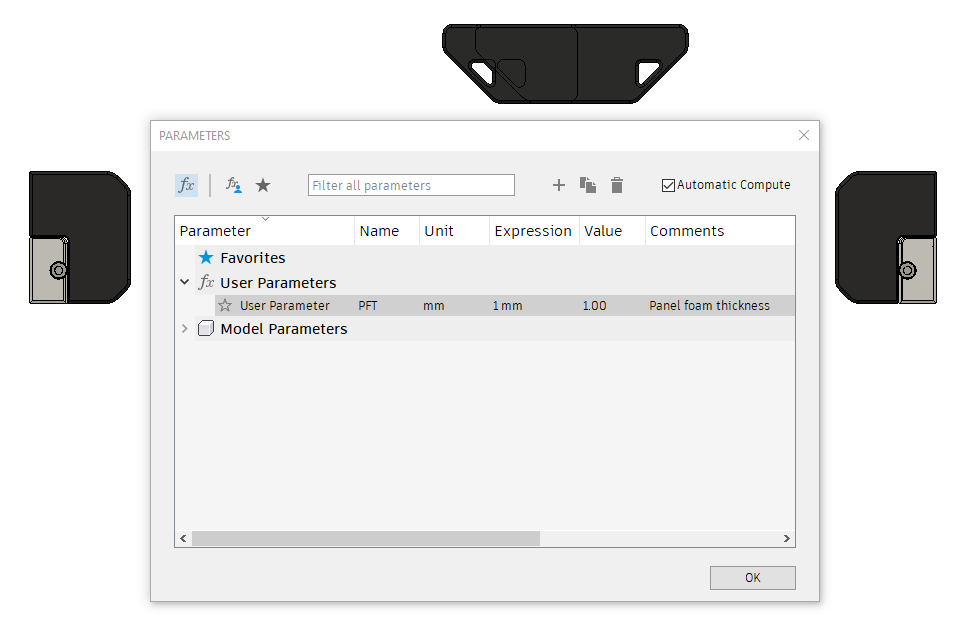

# Lift Off Door Hinges With Handles Configurator

## About
Hinges that lift off.
## Why I decided to create a Configurator:
- In the event that i wanted to use a diffrent foam thickness i can simply change the foam thickness parameter and let the cad do the rest
## Instructions
- Simply Download the [.f3d file](/CAD/Lift_Off_Door%20_Hinge_With_Handles_Configurator.f3d)
- Save the panel hinge parts and the door handle of your choice as a mesh and print (these files do not change and are designed for 3mm thick panels)
- Open the Change parameters window in the Modify Menu
- Change the parameters to match the foamtape thickness you intend to use
- Save each Hinge and latch as a mesh and then print