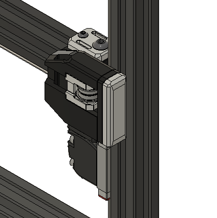
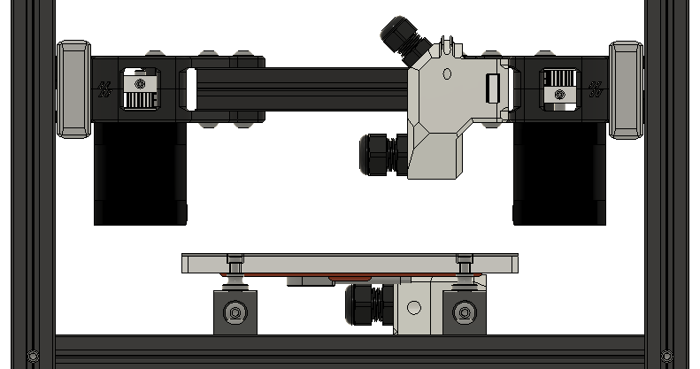

# Modified DoubleT front Idlers for the 2.4

## General info
These are [DoubleT front idlers](https://github.com/PrintersForAnts/Tiny-T/tree/main/STLs/gantry/front_idlers) that [Genevamotion](https://github.com/tdlane1) modifed to have the same concept the [BFI](https://github.com/clee/VoronBFI) use where the layers are under compression.
## Whats diffrent?
I modifed them further to work on a 2.4 and use BFI belt clamps.

## Pros & Cons
### Pros:
- They look awsome!
- no more idler shuttle's splitting
### Cons:
- The only draw back that comes to mind is the tensioning range was reduced from 9mm of travel to 5mm.

## Images:

