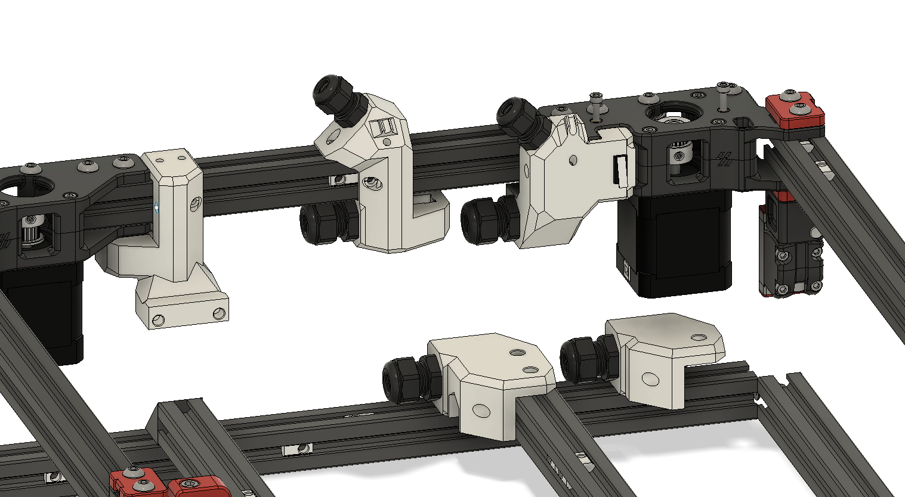

# A z-umbilical Mod for the 2.4

parts for metal AB drives and one for the printed AB drives
two options for ubmilical mount wich attaches to the bed frame. one which can be used for the stock deck panel and another for a custom one which has a 13mm square cut out
Klicky mount is untested.
