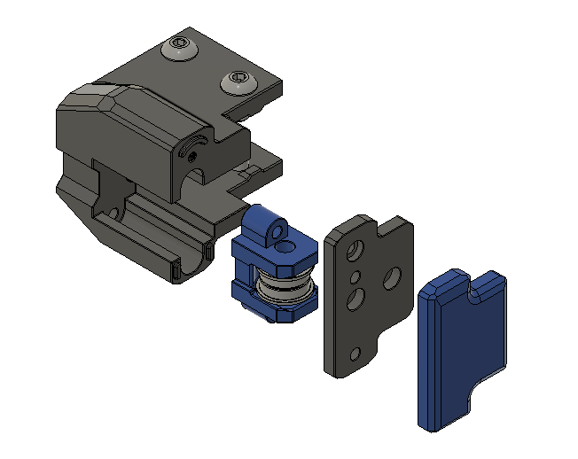
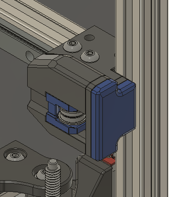
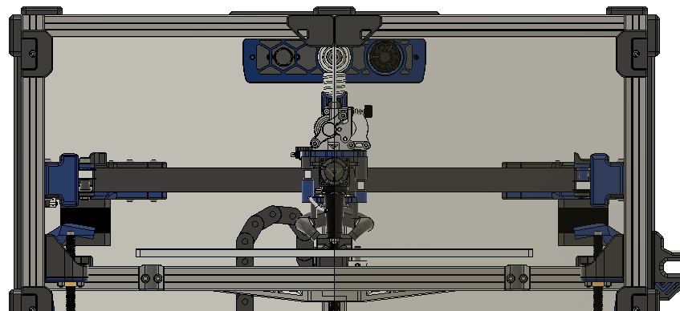

# Modified DoubleT front Idlers for the Vz235
### Disclaimer: This is a Beta project and it may have issues that have yet to be discoverd

## General info
These are [DoubleT front idlers](https://github.com/PrintersForAnts/Tiny-T/tree/main/STLs/gantry/front_idlers) that [Genevamotion](https://github.com/tdlane1) modifed to have the same concept the [BFI](https://github.com/clee/VoronBFI) use where the layers are under compression.
## Whats diffrent?
I modifed them further to work on Vz235 by mirroring the idlers and extended them to work with the VzBot belt path.

## Pros & Cons
### Pros:
- They look awsome!
- no more idler shuttle's splitting
- your front door/ pannel assembly has been simplified and reduced to either 2 doors or one single large door. no more 4 piece front door
### Cons:
- Its not AWD.

## Images:

